<h1 align="center">
  hey there, I'm Lucas
  
</h1>

### :man_technologist: About Me :

  
🚀 AI Full Stack Developer @ Agilize
  
  
🎓 Control & Automation Engineer
  
  
💻 Building scalable apps with a focus on AI
  
  
🛹 Skateboarder
  

---

### :mailbox: How to reach me:

  
   

 

---

### 📊 GitHub Stats

  <table>
    <tr>
      <td>
        
      </td>
      <td>
        
      </td>
    </tr>
  </table>

---

### 🔥 Contribution Streak

---

  </img>

 (365 days graph)

